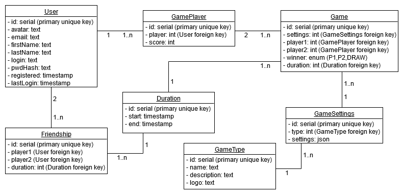

# PuzzleBattle

## About

## Parts of software

### Core

### Server

### Client

## Protocol

### Packet format

#### Unencrypted packet format
| Length  | Packet ID | Packet Data        |
|---------|-----------|--------------------|
| 4 bytes | 1 byte    | \<length\>-1 bytes

#### Encrypted packet format
| Length  | Encrypted data   |
|---------|------------------|
| 4 bytes | \<length\> bytes |

After decrypting the encrypted data, we get the bytes of the unencrypted packet format.

### Authentication process

**Keywords**
- **IV** = Initial vector used at AES 256 encryption
- **C** = Client
- **S** = Server

**Process**
1. Client generates **RSA 2048** keys
2. **C ••► S:** Handshake packet (unencrypted, including the generated public key) 
3. Server generates **AES 256** key, random encryption and decryption IV
4. **S ••► C:** Handshake packet (encrypted using the received public key, includes
the generated AES 256 key, encryption key, decryption key)
5. Client decrypts the received packet with it's **RSA 2048** private key
6. **C ••► S:** Login packet (encrypted using the received enryption key
together with the new IV we are going to use for encryption next time)
7. Server decrypts the received packet with the encryption key, what he sent to client,
and remembers the new IV, which will be used for the next decryption process)   
8. **S ••► C:** Login result packet (encrypted using the decrypt key sent to client together
with the new IV we are going to use for the encryption next time)

### List of packets 

## Database

### Used entities and their relations

### Entity descriptions

#### User

#### Game Player

#### Game

#### Game Type

#### Game Settings 

#### Duration

#### Friendship
